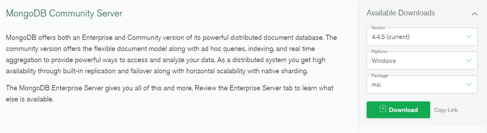
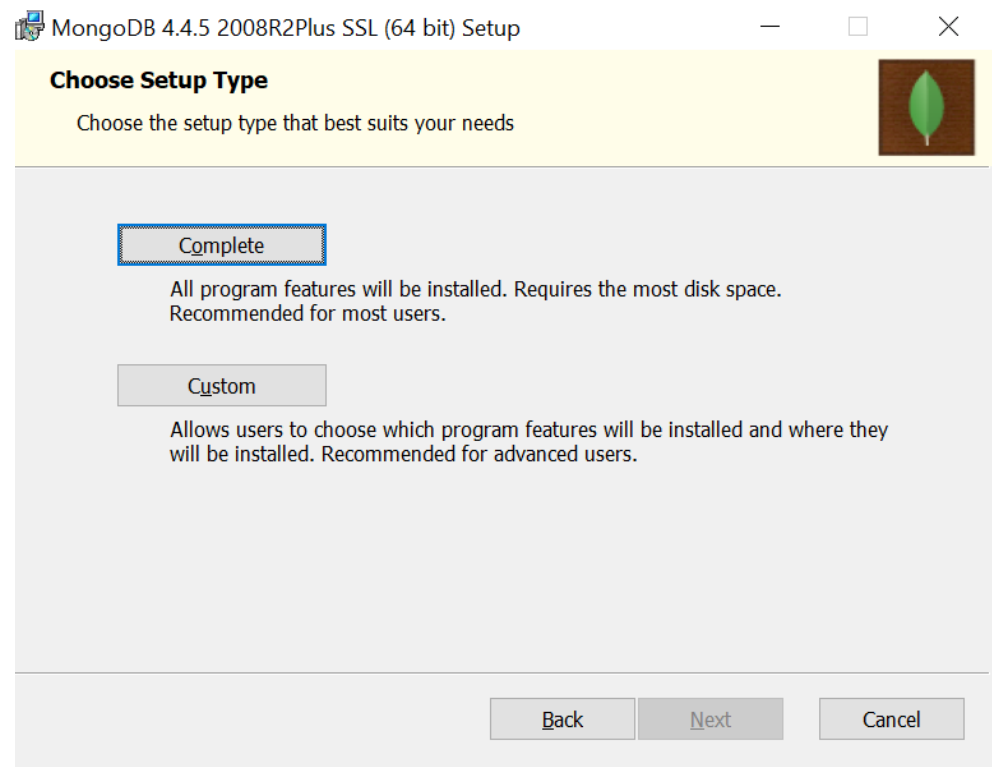
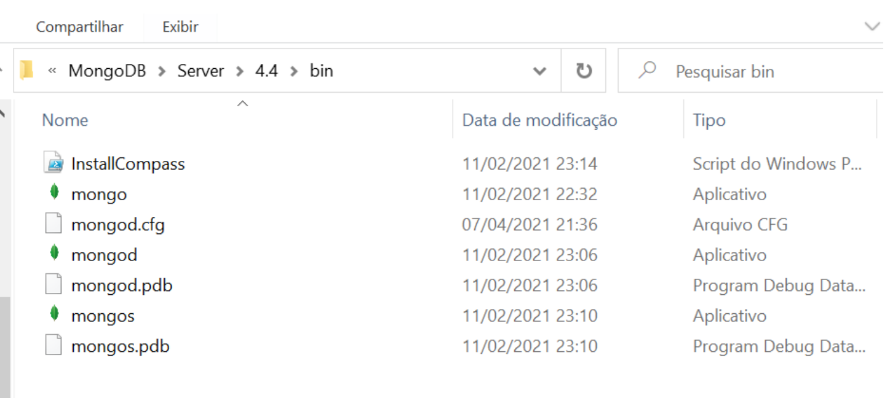
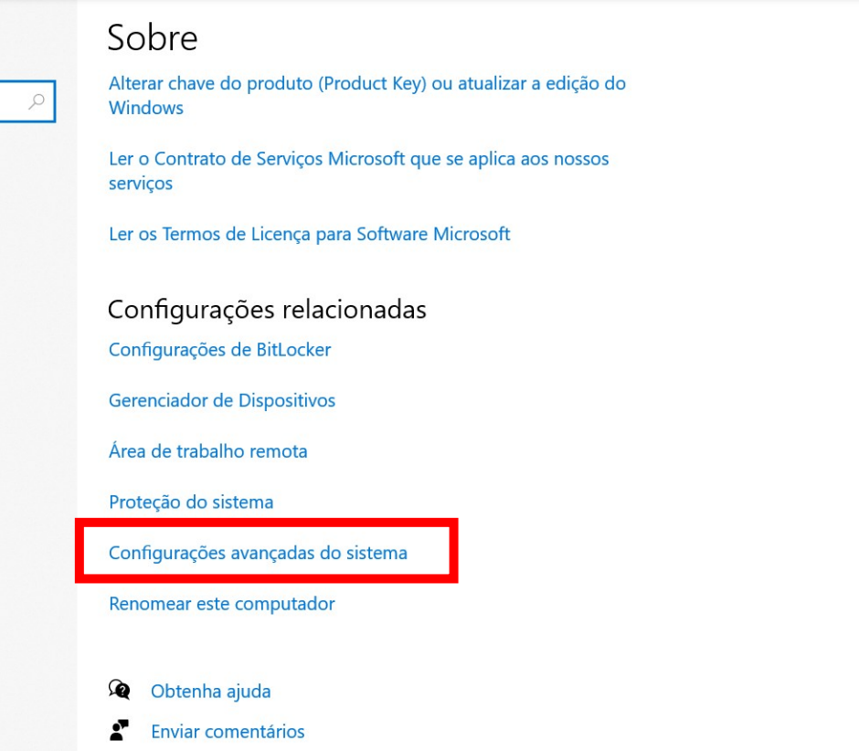
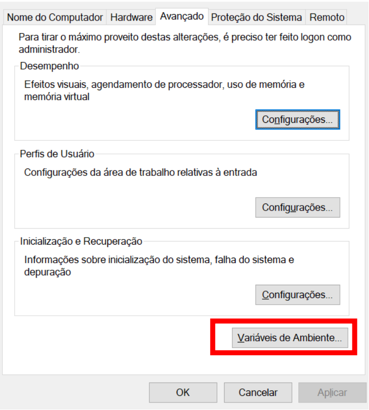
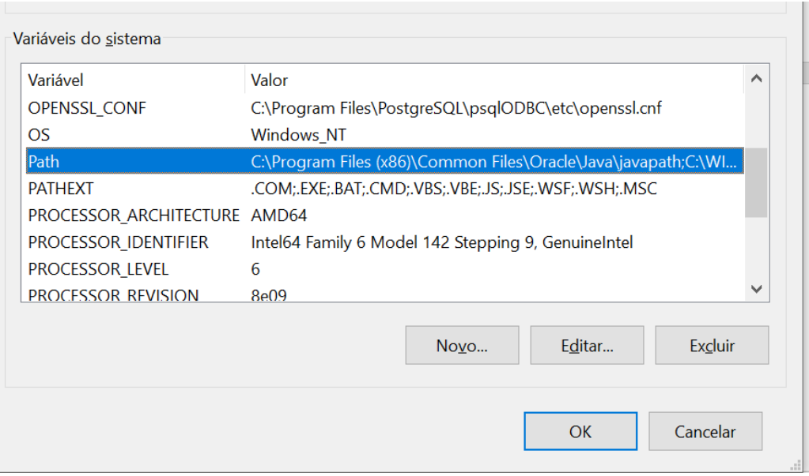
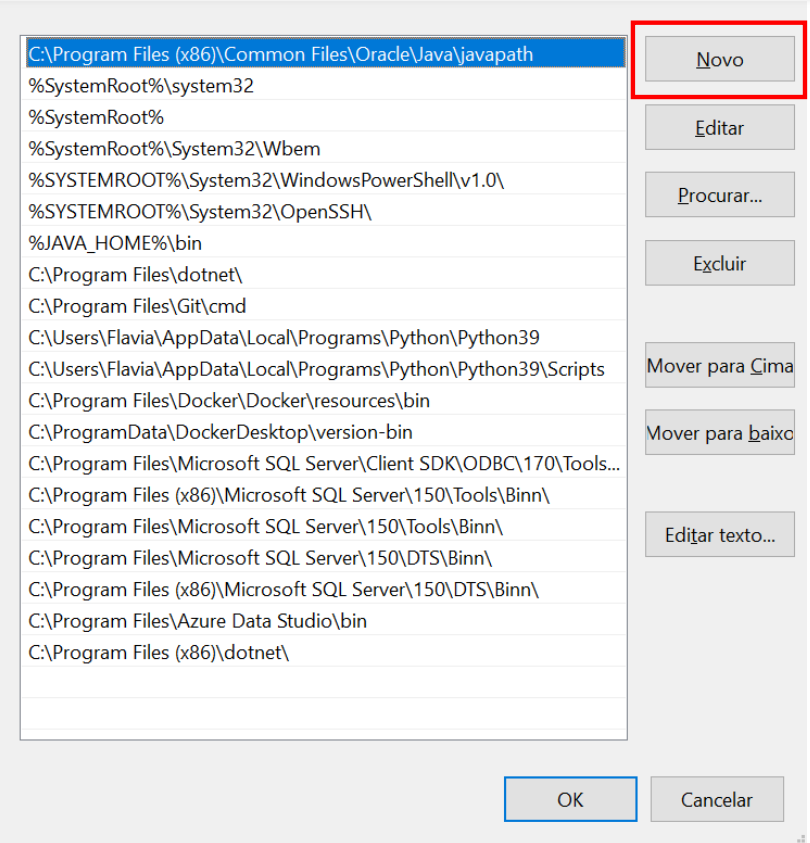
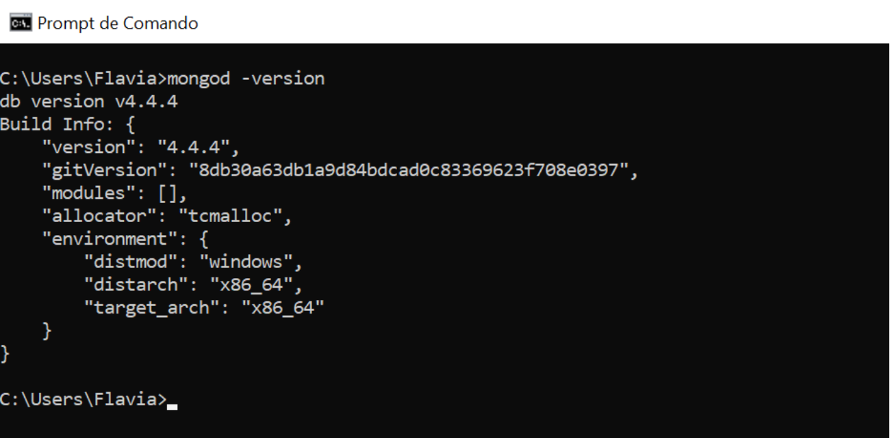
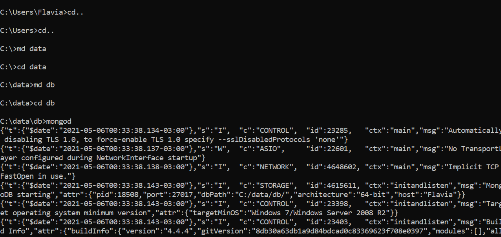
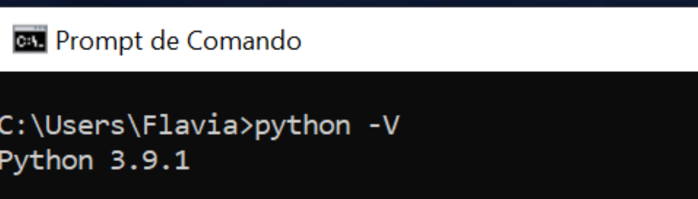

### Instalação do ambiente para o chatbot
Para iniciar o chatbot do Fatequino em sua máquina, os seguintes softwares são necessários:
- MongoDB, versão 4.x.x
- Python3, versão 3.7.x
- pip, versão 19.x.x

### 1. MongoDB

O MongoDB pode ser baixado pelo [site oficial do programa](https://www.mongodb.com/try/download/community).  
Selecione a opção <i>MongoDB Community Server</i>, e em seguida escolha a versão que case com o seu sistema operacional. Esse tutorial segue o processo de instalação em sistemas Windows, mas a instalação pode ser efetuada também em sistemas IOS e Linux. Lembre-se de utilizar a versão mais recente.



Após o término do download, clique no programa, aceite as condições de uso e escolha a opção de instalação completa.



Atente-se ao caminho que o MongoDB foi instalado. Caso não tenha modificado, o caminho padrão é <i><b>Disco Local > Arquivos de Programas > MongoDB > Server > “versão baixada” > bin.</b></i>  
Dentro da pasta haverá dois arquivos importantes o <b>mongo</b> e <b>mongod</b>.



O <b>mongod</b> é um sistema de gerenciamento de banco de dados, enquanto <b>mongo</b> é a interface de linha de comando que permite interagir, inserir, excluir e buscar documentos no MongoDB.  

#### 1.1 Configurando uma Variável de Ambiente

Para usar o Mongo com facilidade no prompt de comando, é importante configurar uma variável de ambiente.

No Windows, você pode configurar a variável de ambiente acessando as "Variáveis de Ambiente" na caixa de pesquisa ou seguindo o caminho "Painel de Controle > Sistema e Segurança > Sistema > Configurações Avançadas do Sistema".



Nas configurações avançadas, escolha a opção "Variáveis de Ambiente".



Nessa nova janela, você encontrará duas opções: "Variáveis de Usuário" e "Variáveis do Sistema". É melhor escolher a segunda opção para garantir acesso adequado. Selecione a variável "Path" e clique em "Editar".



Após clicar em "Editar", uma nova janela se abrirá. Clique em "Novo".



Agora, adicione o caminho de instalação do MongoDB, que normalmente é 
``` powershell
C:\Program Files\MongoDB\Server\4.4\bin
```
Lembre-se de que "4.4" é a versão, então certifique-se de usar a versão correta que está instalada no seu computador. Depois de adicionar o valor, clique em "OK" para salvar. Certifique-se de que o caminho seja salvo, caso contrário, a configuração não funcionará.

Para verificar se o caminho foi configurado corretamente e o MongoDB está instalado, abra o prompt de comando e digite:
``` powershell
mongod -version
```
Se a versão for exibida, sua configuração está correta. Caso contrário, verifique se o caminho e o nome da variável estão corretos.



Uma dica é abrir um novo prompt de comando após configurar a variável de ambiente, caso você já tenha usado um anteriormente.  
Em seguida, você precisará iniciar o servidor MongoDB digitando "mongod" no prompt. Se você encontrar o erro:

``` powershell
exception in initAndListen: 29 Data directory C:\data\db\not found., terminating
```

Isso significa que o MongoDB não está encontrando o diretório "data". Para corrigir isso, siga os seguintes comandos:

- Digite "cd.." para voltar ao diretório anterior até ficar em "C:>";
- Em seguida, digite "md data" para criar um diretório chamado "data";
- Entre no diretório "data" digitando "cd data";
- Use "md db" para criar um diretório chamado "db";
- Entre no diretório "db" digitando "cd db";
- Finalmente, execute "mongod" para iniciar o MongoDB.

Lembre-se de que a janela do prompt não deve ser fechada, caso contrário, o servidor será encerrado.



### 2. Python e PIP

Para instalar o Python, acesse o [link](https://www.python.org/downloads/)

Escolha a versão mais recente e execute o instalador. Antes de clicar em "Install Now", certifique-se de selecionar a opção "Add Python to PATH". Isso poupará a necessidade de configurar uma variável de ambiente separadamente. Se você esqueceu de selecionar essa opção, siga o guia na seção 1.2 para configurar a variável de ambiente posteriormente.

Após clicar em "Install Now", você verá a janela "Optional Features"; deixe todas as opções selecionadas (padrão). Na tela "Advanced Options", não é necessário fazer nenhuma marcação adicional, mantenha as configurações padrão. Preste atenção ao caminho de instalação do Python. Se você não selecionou a opção "Add Python to PATH", é recomendável copiar o caminho para uso posterior. Após a instalação, verifique se o Python foi instalado corretamente no prompt de comando com o comando 
``` powershell
python -V
```



Se não conseguir ver a versão, verifique as variáveis de ambiente para garantir que a variável "PATH" do Python tenha sido criada corretamente.

<style>
    img{
    max-height: 500px !important;
    margin-top: 2em;
    margin-bottom: 2em;
    }
</style>
